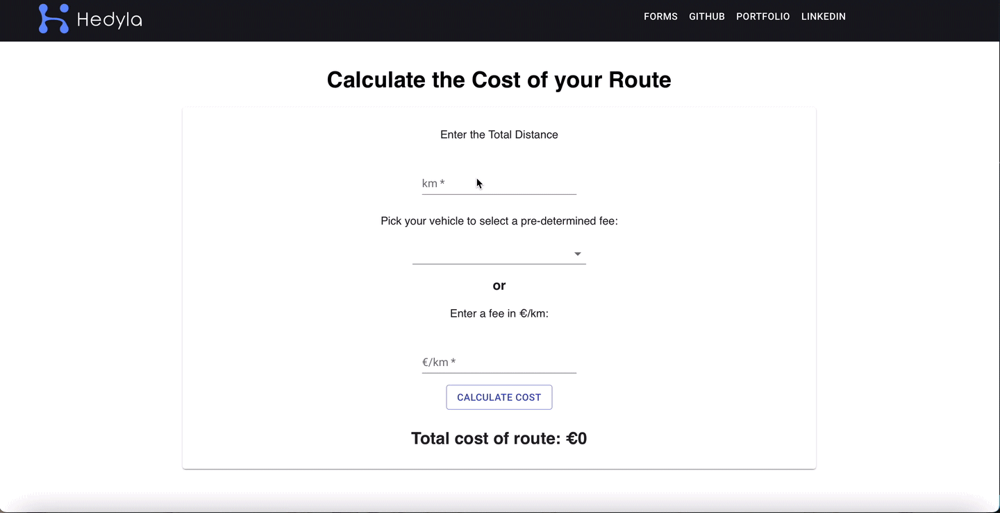

<!--
*** Thanks for checking out this README Template. If you have a suggestion that would
*** make this better, please fork the repo and create a pull request or simply open
*** an issue with the tag "enhancement".
*** Thanks again! Now go create something AMAZING! :D
-->

<!-- PROJECT SHIELDS -->
<!--
*** I'm using markdown "reference style" links for readability.
*** Reference links are enclosed in brackets [ ] instead of parentheses ( ).
*** See the bottom of this document for the declaration of the reference variables
*** for contributors-url, forks-url, etc. This is an optional, concise syntax you may use.
*** https://www.markdownguide.org/basic-syntax/#reference-style-links
-->
[![Contributors][contributors-shield]][contributors-url]
[![Forks][forks-shield]][forks-url]
[![Stargazers][stars-shield]][stars-url]
[![Issues][issues-shield]][issues-url]

<!-- PROJECT LOGO -->
<br />
<p align="center">
  <a href="https://github.com/BrittanyBlake/frontend-assessment-hedyla">
    <p align="center">  </p>
  </a>

  <h2 align="center">Hedyla Frontend Technical Test</h2>

  <p align="center">
    <a href="https://github.com/BrittanyBlake/frontend-assessment-hedyla/issues">Report Bug</a>
    · 
    <a href="https://github.com/BrittanyBlake/frontend-assessment-hedyla/issues">Request Feature</a>
  </p>
</p>

<!-- TABLE OF CONTENTS -->
## Table of Contents

* [About the Project](#about-the-project)
* [Installation](#installation)
* [Live Link](#Live-Link-(Heroku))
* [Route Cost Calculator](#Route-cost-calculator)
* [Built With](#built-with)
* [Future Updates](#future-updates)
* [Contact](#Authors)
* [Acknowledgements](#acknowledgements)

<!-- ABOUT THE PROJECT -->
## About The Project

This assignment is for the frontend position at Hedyla. The requirement was to create a route cost calculator with two parts. The first step was to create a simplified version of the route cost calculator where the user can enter the distance and the price per kilometer. It was then modified so the user can select a predetermined fee based on the vehicle type. The second version of the route cost calculator follows the basic functionality of the simple route cost calculator, but allows the user to calculate the distance based off coordinates given using the OSRM API. It also shows those coordinates on the map using Google Maps.


## Route Cost Calculator using Co-ordinates
<p align="center">
    
</p>

## Simple Route Cost Calculator using inputs
<p align="center">
    
</p>
<!-- Live Link (Netlify) -->

## Live Link (Heroku)

[Click here](https://hedyla-assessment.herokuapp.com)

<!-- INSTALLATION -->

## Installation

To run the technical test locally, clone the repository, navigate to it's containing directory.

#### Follow these commands step by step:-  
```bash
git@github.com:BrittanyBlake/frontend-assessment-hedyla.git
cd frontend-assessment-hedyla.
npm install
npm start
```

Now it will successfully open the technical test locally in your browser.

<!-- BUILD WITH -->

## Built With

- React
- Redux
- Redux-thunk
- Redux Hooks
- prop-types
- Axios
- Eslint
- Stylelint
- NPM
- Github
- Material-ui
- [Heroku](https://hedyla-assessment.herokuapp.com) 


<!-- CONTACT -->
## Author

👤 **Brittany Blake**

- Github: [@BrittanyBlake](https://github.com/BrittanyBlake)
- Twitter: [@bbcodes_](https://twitter.com/bbcodes_)
- Linkedin: [Brittany Blake](https://www.linkedin.com/in/brittany-a-blake/)

## Show your support

Give a ⭐️ if you like this project!

<!-- MARKDOWN LINKS & IMAGES -->
<!-- https://www.markdownguide.org/basic-syntax/#reference-style-links -->
[contributors-shield]: https://img.shields.io/github/contributors/BrittanyBlake/frontend-assessment-hedyla.svg?style=flat-square
[contributors-url]: https://github.com/BrittanyBlake/frontend-assessment-hedyla/graphs/contributors
[forks-shield]: https://img.shields.io/github/forks/BrittanyBlake/frontend-assessment-hedyla.svg?style=flat-square
[forks-url]: https://github.com/BrittanyBlake/frontend-assessment-hedyla/network/members
[stars-shield]: https://img.shields.io/github/stars/BrittanyBlake/frontend-assessment-hedylastyle=flat-square
[stars-url]: https://github.com/BrittanyBlake/frontend-assessment-hedyla/stargazers
[issues-shield]: https://img.shields.io/github/issues/BrittanyBlake/frontend-assessment-hedyla.svg?style=flat-square
[issues-url]: https://github.com/BrittanyBlake/frontend-assessment-hedyla/issues

## 📝 License

This project is [MIT](https://opensource.org/licenses/MIT) licensed.
